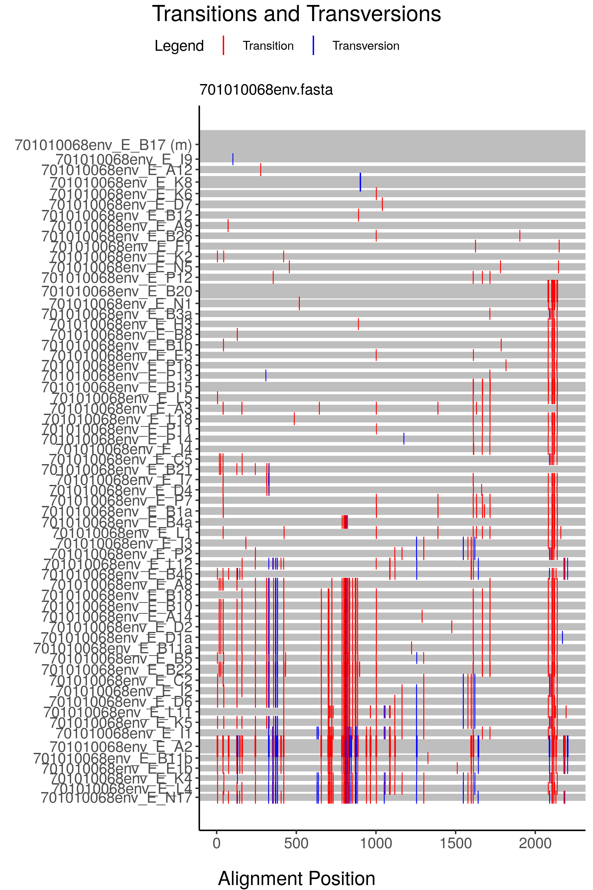
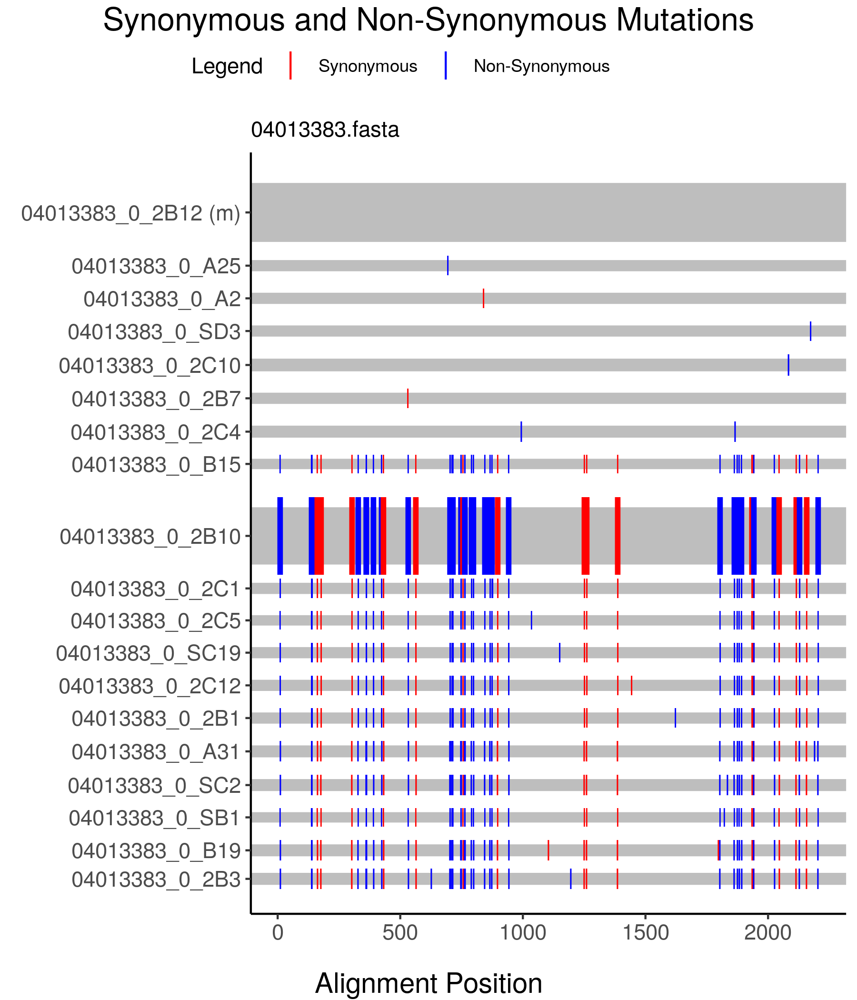

<!-- README.md is generated from README.Rmd. Please edit that file -->

# highlineR: a tool for visualizing NGS datasets in R

[Highlighter](https://www.hiv.lanl.gov/content/sequence/HIGHLIGHT/highlighter_top.html)
is a web-based tool maintained by the Los Alamos National Laboratory
(LANL) HIV Sequence Database that makes it easy for investigators to
visually scan their sequence alignments for compositional differences.
However, it is inconvenient for users to use Highlighter to process a
large number of alignment files as the tool only accepts a single file
as input. In addition, the LANL website limits users to a maximum of 500
sequences per file, which can be problematic for users working with
alignments derived from next-generation sequencing platforms.
Furthermore, the tool does not visualize the frequencies of different
sequence variants in a dataset.

*highlineR* is a free, open-source R package that provides users with
accessible functions for batch-processing of sequence alignments,
including NGS data, to generate plots similar to Highlighter. In
addition, *highlineR* extends the Highlighter plot by varying line
widths to represent variant frequencies in the data (see *Usage*).

## Installation

The simplest method to install *highlineR* is to use the R *devtools*
package:

``` r
# install.packages("devtools")  # if not already installed
require(devtools)
devtools::install_github("PoonLab/highlineR")
```

## Usage

As a basic example of using `highlineR`, we’re going to load a number of
anonymized [data
sets](https://www.hiv.lanl.gov/content/sequence/HIV/USER_ALIGNMENTS/Li/)
sets from [a published
study](https://journals.plos.org/plospathogens/article?id=10.1371/journal.ppat.1000890)
of HIV-1 diversity within patients:

``` r
require(highlineR)
#> Loading required package: highlineR
# use glob to retrieve paths to FASTA files
files <- Sys.glob('~/git/highlineR/inst/extdata/*.fasta')
highline(files[1:2])  # render the first two alignments
```


Each horizontal grey band represents a sequence variant. The *area* of
the band is proportional to the number of times that variant occurs in
the alignment. (It may be more intuitive to make *height* proportional
to variant counts, but this causes problems when a variant occurs 1000
times or more\!) By default, `highlineR` selects the most common variant
to be the master (reference) sequence and places it at the top of the
plot — it is also labeled with an `(m)`.

Each band is decorated with coloured tick marks to indicate the
locations of nucleotide (or amino acid) differences relative to the
master sequence. A colour reference key (legend) is provided at the top
of the plot.

Note that for the above example, the files were loaded from a developer
directory. To load these same files from your installed package as a
user, you’d have to replace the following line:

``` r
# files <- Sys.glob('~/git/highlineR/inst/extdata/*.fasta')
files <- Sys.glob(paste0(system.file(package='highlineR'), '/extdata/*.fasta'))
```

## Background

A *multiple sequence alignment* (MSA) is a hypothesis about how residues
(nucleotides or amino acids) in two or more sequences were derived from
residues in a common ancestral sequence. By convention, each sequence is
arranged horizontally in rows to be read from left to right, and
evolutionarily-related (homologous) residues are arranged vertically in
a column. It is possible for two or more sequences to be exactly
identical. When this occurs, we refer to the shared sequence as the
“sequence variant”, and the number of times this variant appears in
the data as its “count”. (Note there is no established terminology for
these features.) It is common practice to reduce a sequence alignment to
the unique variants, especially when certain variants predominate the
sample population. By doing so, however, we lose information on the
relative abundance of variants.

If an MSA comprises a large number of sequences, it may become difficult
to visualize the composition of the alignment. *Highlighter* plots were
developed to reduce the information in the MSA by marking the location
of residues that are different from the reference sequence, which has
been selected by the user or the program. We refer to this reference
sequence the *master sequence*. By default, the `highline` function
selects the most common sequence variant to be the master.

The `highline` function is actually a high-level wrapper for several
functions in `highlineR`. These lower level functions are exposed to the
user, so you have the option of doing more extensive customization than
`highline` will allow. Detailed instructions for using (and potentially
modifying) these functions are provided in the
[CONTRIBUTING.md](CONTRIBUTING.md) document.

In summary, the pipeline for generating a plot in `highlineR` are:

1.  Initialize a `highlineR` session. This creates an R
    [environment](http://adv-r.had.co.nz/Environments.html) for storing
    the sequence alignment data sets.

2.  Import one or more sequence alignments from the respective files.
    `highlineR` supports FASTA, FASTQ and CSV file formats.

3.  Parse the raw sequence data from each file.

4.  Compress the sequence data so that identical sequences are
    represented by a single copy annotated by the number of instances in
    the alignment.

5.  Calculate the sequence differences from the “master sequence” and
    generate the *Highlighter* style plot.

## Further examples

  - Batch process a set of FASTA files and save the results as PDF
    files.

<!-- end list -->

``` r
require(highlineR)
files <- Sys.glob('~/git/highlineR/inst/extdata/*.fasta')
for (f in files) {
  # prepare output file path
  of <- sub(pattern=".fasta$", replacement=".pdf", x=f)
  of <- sub("inst/extdata", "working", of)  # switch dir
  # start plot device to PDF file
  pdf(of, width=6, height=6, onefile=F)
  print(highline(f))
  dev.off()  # turn off plot device
}
```

  - Annotate the Highlighter plot by transitions and
transversions.

<!-- end list -->

``` r
highline(files[3], mode='tvt')
```



  - Annotate the Highlighter plot by non-synonymous and synonymous
    differences (note that the reading frame can be modified with the
    `rf`
argument.)

<!-- end list -->

``` r
highline(files[2], mode='svn')
```



## Feature requests and issues

Please use our [issue
tracker](https://github.com/PoonLab/highlineR/issues) to report problems
that you encountered while using this package. Provide information on
your operating system, R version and (ideally) a minimum reproducible
example. If there’s some change or additional feature that you’d like to
see in `highlineR`, you can also post a request on the issue tracker.
