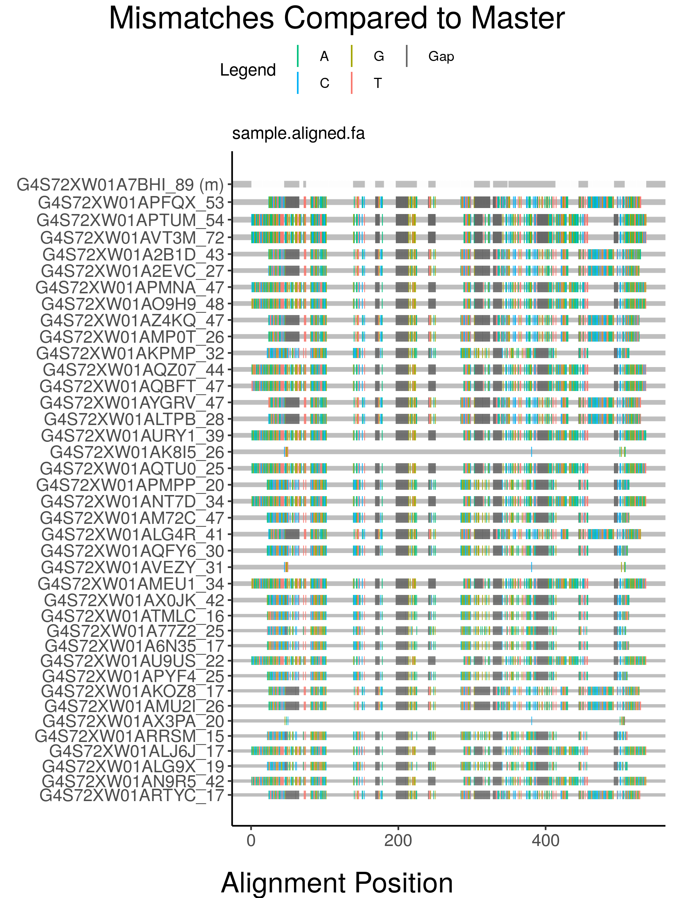
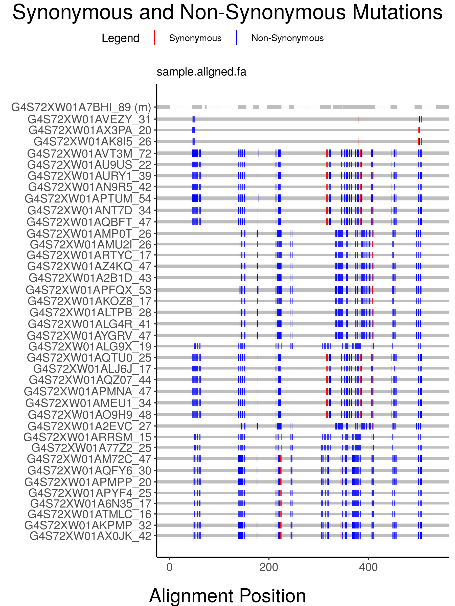
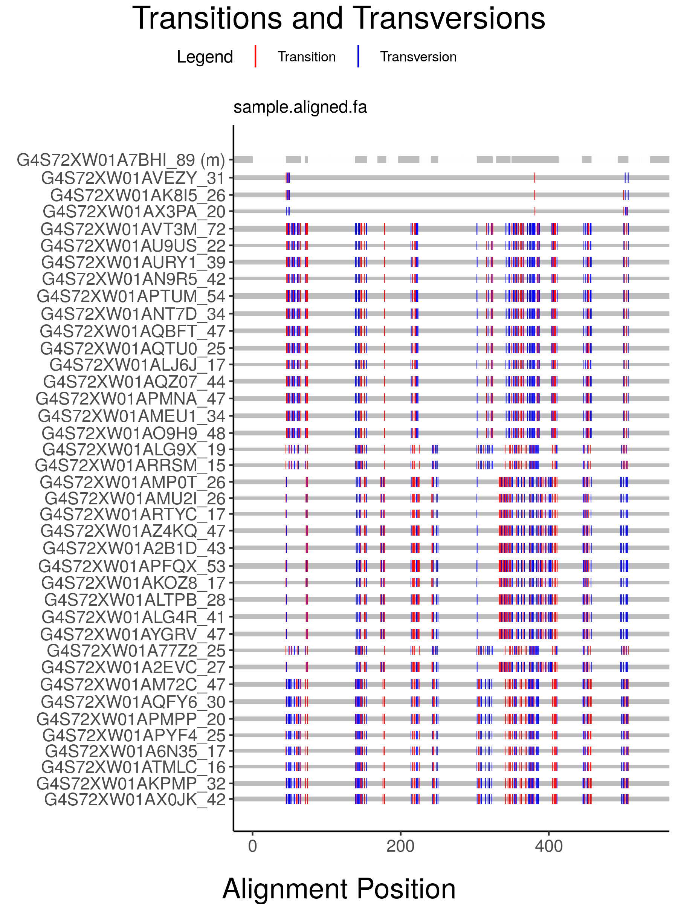

<!-- README.md is generated from README.Rmd. Please edit that file -->
highlineR: a tool for visualizing NGS datasets in R
===================================================

[Highlighter](https://www.hiv.lanl.gov/content/sequence/HIGHLIGHT/highlighter_top.html) is a web-based tool maintained by the Los Alamos National laboratory that makes it easy for investigators to quickly scan their NGS data for compositional differences. However, it is inconvenient for users to use Highlighter to process a large number of NGS files as the tool only accepts a single file as input and limits users to 500 sequences per file. Furthermore, the tool does not visualize the frequencies of different sequence variants in a dataset.

The 'highlineR' package provides users with easy-to-use functions for batch-processing of NGS data and generating plots similar to Highlighter that “stretch” lines to indicate variant frequencies in the data.

Installation
------------

You can install the released version of highlineR from [CRAN](https://CRAN.R-project.org) with:

``` r
install.packages("highlineR")
```

And the development version from [GitHub](https://github.com/) with:

``` r
# install.packages("devtools")
devtools::install_github("PoonLab/highlineR")
```

Import
------

HighlineR accepts aligned nucleotide or amino acid NGS data in the FASTA format as input. Aligned sequences stored in FASTQ format can also be converted and read by the program. In theory, data generated using any NGS instrument and methodology can be input to highlineR as long as the sequence alignment is supplied in an accepted file format. There is no limit on the number of sequences that a file may contain nor on the number of files that may be input.

The import function accepts three types of input:

1.  A path to a single NGS file,

2.  A path to a directory containing NGS file(s), or

3.  A vector of paths to NGS file(s).

For example, let's import a FASTA file to analyze using highlineR. (Data adapted from [Ferrandiz-Rovira et. al.](https://www.nature.com/articles/hdy201513#data-archiving) available [here](http://evobiolab.biol.amu.edu.pl/amplisat/index.php?examples))

``` r
library(highlineR)
highlineR.session <- init_session() # create session
base <- system.file('extdata', package = "highlineR")
fn <- paste0(base, "/sample.aligned.fa")

# Default import
import_raw_seq(fn)
#> <environment: 0x7fcb4aca9b70>
#> attr(,"class")
#> [1] "session"     "environment"
```

highlineR recognizes standard file extensions (.fasta, .fa, .fas, .fastq, .fq). If a nonstandard file extension is being used (eg .txt) then the file format can be specified as follows:

``` r
# Import NGS files with non-standard file extensions
import_raw_seq("/sample.txt", datatype = "fasta")
```

The file we are using contains nucleotide sequences. If the file of interest contains amino acid sequences instead then run:

``` r
# Import amino acid data
import_raw_seq("/sample.aligned.fa", seqtype = "amino acid")
```

The `import_raw_seq()` function creates an S3 object called a `Data` object with the following structure:

``` r
# Classes of Data objects
str(highlineR.session[[fn]])
#> Classes 'fasta', 'nucleotide', 'Data', 'environment' <environment: 0x7fcb4d336bf0>

# Attributes of Data objects
ls(highlineR.session[[fn]])
#> [1] "compressed" "master"     "path"       "raw_seq"    "sample"    
#> [6] "seq_diff"
```

This means that the classes of a `Data` object provide information about the data type of the NGS file and the sequence type of the sequences contained in the file.

`Data` objects are comprised of the following attributes:

-   `path` is the absolute path to the NGS file represented by the object,

-   `raw_seq` is a list that will contain the parsed sequences of the NGS file,

-   `compressed` is an S3 object that inherits from R's base `environment` class and will contain the compressed sequences of the NGS file,

-   `sample` is a compressed environment that will contain randomly sampled sequences from the the compressed structure,

-   `master` is a character string representing the master sequence to which other sequences will be compared during plotting, and

-   `seq_diff` is a character matrix that will contain sequence differences in variant sequences compared to the master sequence.

The `import_raw_seq()` function also creates another S3 object called a `session` object that acts as a parent container to hold multiple `Data` objects for later plotting. This functionality allows multiple NGS files to be added to a single `session` by unique function calls for later batch processing.

In the above example, we first created an empty `session` using the `init_session()` function. This function returns the created `session` object which must be stored by the user for further use. In the above example, the `session` was named `highlineR.session`. This is the default name expected by the program. Following this, if the session argument is not provided, `Data` objects are added to the `highlineR.session` object by default.

To override this default behaviour, the `session` created using `init_session()` can be stored using a different variable name `Data` objects can be imported into that `session`, using the session argument. Alternatively, the result returned by the `import_raw_seq()` function can be stored without a direct call to `init_session()`:

``` r
# Import into initialized session
my_session <- init_session()
import_raw_seq(fn, session = "my_session")

# Import into uninitialized session
my_session <- import_raw_seq(fn) # To create session using only one import call, the session argument is not needed
# To add more Data objects to the custom session, you must specify the session argument
import_raw_seq(paste0(base, "/sample.fa"), session = my_session)
```

Parsing
-------

Following data import, single `Data` objects or complete `session` objects can be parsed as follows:

``` r
# Parse single Data object
# parse_raw_seq(highlineR.session$`./data/sample.aligned.fa`)

# Parse entire session
parse_raw_seq(highlineR.session)
```

The `parse_raw_seq()` function stream reads NGS files and populates the `raw_seq` lists of Data objects with `(header, sequence)` tuples.

``` r
# Strucure of the parsed file
head(highlineR.session[[fn]]$raw_seq, n=3)
#> [[1]]
#> [[1]]$header
#> [1] "G4S72XW01A7BHI_89"
#> 
#> [[1]]$sequence
#> [1] "--------------------------------------------TTGCAAGCAGGTTGCTCAGGC-----CCAC----------------------------------------------------------------TTGGTCACTCTGTGCA--------------TTGCCCTTGGCA----------------ATCCGTGTGTTCCGTTTCCAATACCCCGG---------------CCCCTCCTGC----------------------------------------------------TCTATCCATGGCGCTCGCGGCT----CCATCCTCGGCTTCGGGGCG-TCGCTGTCAAAGCGCACGAACTGCGTGTCCTTCACATAGCCCACTTCCATATGCCGGGGCTCCC-------------------------------CTCCGGGGCCGGG-----------------------------------ACACGGAGGTTAGTT-----------------------------"
#> 
#> 
#> [[2]]
#> [[2]]$header
#> [1] "G4S72XW01AVT3M_72"
#> 
#> [[2]]$sequence
#> [1] "AACCGAACGATTCCTGCAGCAGATGAAAGCTGAGTGTCATTTTTTCAATGGGACAGAGCGGGTGTGGC--ATGT------GACCAGATACATCTTTAACCAG------------------------------------GAGGAAATCCTGCGCT--------------------TTGACA---------------------------------GCGATGTGGGGG---------------------------------------------------------------AATTTCGGGC----A-----------GTTAGCGAGC----------------TGGGGCAG-CCCATAGCTGAGTACTTGAACAGCCAGAAGGACATCCTG---------------GACAATTACCGCGCCGCTGTGGACA---GGTGCAGAAACAACTACGCGCTTGTT-----------------------------------------AGCCTAATGTCAAAGCGGAGAGTTAAGCCGAAGTCTCT"
#> 
#> 
#> [[3]]
#> [[3]]$header
#> [1] "G4S72XW01APTUM_54"
#> 
#> [[3]]$sequence
#> [1] "CACAGTACGATTCCTGCAGCAGATGAAAGCTGAGTGTCATTTTTTCAATGGGACAGAGCGGGTGTGGC--ATGT------GACCAGATACATCTTTAACCAG------------------------------------GAGGAAATCCTGCGCT--------------------TTGACA---------------------------------GCGATGTGGGGG---------------------------------------------------------------AATTTCGGGC----A-----------GTTAGCGAGC----------------TGGGGCAG-CCCATAGCTGAGTACTTGAACAGCCAGAAGGACATCCTG---------------GACAATTACCGCGCCGCTGTGGACA---GGTGCAGAAACAACTACGCGCTTGTT-----------------------------------------AGCCTAATGTCAAAGCGGAGAGTTAAGCCGAATACGTG"
```

Compression
-----------

After parsing, `Data` or `session` objects will be compressed into a format reminiscent of a dictionary structure of key:value pairs. In this structure, unique sequences serve as keys with read counts as values. `Data` or `session` objects can be compressed as follows:

``` r
# Compression
compress(highlineR.session, unique = TRUE)
```

The `unique` flag specifies that the NGS file that we are working with has been processed so that it only contains unique sequences with read counts stored at the end of the sequence labels. If read counts should be inferred from the number of distinct instances of sequences in the file, then this flag should be `FALSE`.

The `compress()` function populates the `compressed` environments of `Data` objects.

``` r
# Number of unique sequences in compressed structure
c_len <- length(highlineR.session[[fn]]$compressed)
c_len
#> [1] 343

# Most abundant sequences in compressed structure
sort(highlineR.session[[fn]]$compressed)[c_len:(c_len-2), , drop = F]
#>                                                                                                                                                                                                                                                                                                                                                                                                                                                                                                                                                          freq
#> --------------------------------------------TTGCAAGCAGGTTGCTCAGGC-----CCAC----------------------------------------------------------------TTGGTCACTCTGTGCA--------------TTGCCCTTGGCA----------------ATCCGTGTGTTCCGTTTCCAATACCCCGG---------------CCCCTCCTGC----------------------------------------------------TCTATCCATGGCGCTCGCGGCT----CCATCCTCGGCTTCGGGGCG-TCGCTGTCAAAGCGCACGAACTGCGTGTCCTTCACATAGCCCACTTCCATATGCCGGGGCTCCC-------------------------------CTCCGGGGCCGGG-----------------------------------ACACGGAGGTTAGTT-----------------------------   89
#> AACCGAACGATTCCTGCAGCAGATGAAAGCTGAGTGTCATTTTTTCAATGGGACAGAGCGGGTGTGGC--ATGT------GACCAGATACATCTTTAACCAG------------------------------------GAGGAAATCCTGCGCT--------------------TTGACA---------------------------------GCGATGTGGGGG---------------------------------------------------------------AATTTCGGGC----A-----------GTTAGCGAGC----------------TGGGGCAG-CCCATAGCTGAGTACTTGAACAGCCAGAAGGACATCCTG---------------GACAATTACCGCGCCGCTGTGGACA---GGTGCAGAAACAACTACGCGCTTGTT-----------------------------------------AGCCTAATGTCAAAGCGGAGAGTTAAGCCGAAGTCTCT   72
#> CACAGTACGATTCCTGCAGCAGATGAAAGCTGAGTGTCATTTTTTCAATGGGACAGAGCGGGTGTGGC--ATGT------GACCAGATACATCTTTAACCAG------------------------------------GAGGAAATCCTGCGCT--------------------TTGACA---------------------------------GCGATGTGGGGG---------------------------------------------------------------AATTTCGGGC----A-----------GTTAGCGAGC----------------TGGGGCAG-CCCATAGCTGAGTACTTGAACAGCCAGAAGGACATCCTG---------------GACAATTACCGCGCCGCTGTGGACA---GGTGCAGAAACAACTACGCGCTTGTT-----------------------------------------AGCCTAATGTCAAAGCGGAGAGTTAAGCCGAATACGTG   54
```

The `N` and `M` arguments to the `compress()` function are used to determine the behaviour of the sampling functions described below which populate the `sample` environments of `Data` objects.

### Sampling

In an NGS experiment, if the number of input sequences is much greater than the number of templates (nucleic acids) available during the sequencing reaction, then the frequency distribution of variants produced may be skewed. In an attempt to accommodate for this phenomenon, highlineR utilizes a read\_sample() function which randomly samples N reads with replacement, M times. The average of the resulting frequencies of variants present in at least 85% of the replicates is then used as the expected variant frequencies.

Sampling is performed automatically during compression. A dataset can be resampled without re-compressing using the `resample()` function.

``` r
# Sample created during compression
# Number of sequences in sample environment
s_len <- length(highlineR.session[[fn]]$sample)
s_len
#> [1] 181

# Most abundance sequences in sample environment
sort(highlineR.session[[fn]]$sample)[s_len:(s_len-2), , drop = F]
#>                                                                                                                                                                                                                                                                                                                                                                                                                                                                                                                                                          freq
#> AACCGAACGATTCCTGCAGCAGATGAAAGCTGAGTGTCATTTTTTCAATGGGACAGAGCGGGTGTGGC--ATGT------GACCAGATACATCTTTAACCAG------------------------------------GAGGAAATCCTGCGCT--------------------TTGACA---------------------------------GCGATGTGGGGG---------------------------------------------------------------AATTTCGGGC----A-----------GTTAGCGAGC----------------TGGGGCAG-CCCATAGCTGAGTACTTGAACAGCCAGAAGGACATCCTG---------------GACAATTACCGCGCCGCTGTGGACA---GGTGCAGAAACAACTACGCGCTTGTT-----------------------------------------AGCCTAATGTCAAAGCGGAGAGTTAAGCCGAAGTCTCT    7
#> --------------------------------------------TTGCAAGCAGGTTGCTCAGGC-----CCAC----------------------------------------------------------------TTGGTCACTCTGTGCA--------------TTGCCCTTGGCA----------------ATCCGTGTGTTCCGTTTCCAATACCCCGG---------------CCCCTCCTGC----------------------------------------------------TCTATCCATGGCGCTCGCGGCT----CCATCCTCGGCTTCGGGGCG-TCGCTGTCAAAGCGCACGAACTGCGTGTCCTTCACATAGCCCACTTCCATATGCCGGGGCTCCC-------------------------------CTCCGGGGCCGGG-----------------------------------ACACGGAGGTTAGTT-----------------------------    7
#> TTCTCGACGATTCCTGCAGCAGATGAAAGCTGAGTGTCATTTTTTCAATGGGACAGAGCGGGTGTGGC--ATGT------GACCAGATACATCTTTAACCAG------------------------------------GAGGAAATCCTGCGCT--------------------TTGACA---------------------------------GCGATGTGGGGG---------------------------------------------------------------AATTTCGGGC----A-----------GTTAGCGAGC----------------TGGGGCAG-CCCATAGCTGAGTACTTGAACAGCCAGAAGGACATCCTG---------------GACAATTACCGCGCCGCTGTGGACA---GGTGCAGAAACAACTACGCGCTTGTT-----------------------------------------AGCCTAATGTCAAAGCGGAGAGTTAAGCCGAAGTCTCT    5

# Resampling
resample(highlineR.session[[fn]], 
         N = c_len * 0.75,
         M = 10)
#> <environment: 0x7fcb4d331ab0>
#> attr(,"class")
#> [1] "compressed"  "environment"

# New number of sequences in sample environment
new_s_len <- length(highlineR.session[[fn]]$sample)
new_s_len
#> [1] 40

# Most abundance sequences in new sample environment
sort(highlineR.session[[fn]]$sample)[new_s_len:(new_s_len-2), , drop = F]
#>                                                                                                                                                                                                                                                                                                                                                                                                                                                                                                                                                          freq
#> --------------------------------------------TTGCAAGCAGGTTGCTCAGGC-----CCAC----------------------------------------------------------------TTGGTCACTCTGTGCA--------------TTGCCCTTGGCA----------------ATCCGTGTGTTCCGTTTCCAATACCCCGG---------------CCCCTCCTGC----------------------------------------------------TCTATCCATGGCGCTCGCGGCT----CCATCCTCGGCTTCGGGGCG-TCGCTGTCAAAGCGCACGAACTGCGTGTCCTTCACATAGCCCACTTCCATATGCCGGGGCTCCC-------------------------------CTCCGGGGCCGGG-----------------------------------ACACGGAGGTTAGTT-----------------------------    4
#> TTCTCGACGATTCCTGCAGCAGATGAAAGCTGAGTGTCATTTTTTCAATGGGACAGAGCGGGTGTGGC--ATGT------GACCAGATACATCTTTAACCAG------------------------------------GAGGAAATCCTGCGCT--------------------TTGACA---------------------------------GCGATGTGGGGG---------------------------------------------------------------AATTTCGGGC----A-----------GTTAGCGAGC----------------TGGGGCAG-CCCATAGCTGAGTACTTGAACAGCCAGAAGGACATCCTG---------------GACAATTACCGCGCCGCTGTGGACA---GGTGCAGAAACAACTACGCGCTTGTT-----------------------------------------AGCCTAATGTCAAAGCGGAGAGTTAAGCCGAAGTCTCT    3
#> CACAGTACGATTCCTGCAGCAGATGAAAGCTGAGTGTCATTTTTTCAATGGGACAGAGCGGGTGTGGC--ATGT------GACCAGATACATCTTTAACCAG------------------------------------GAGGAAATCCTGCGCT--------------------TTGACA---------------------------------GCGATGTGGGGG---------------------------------------------------------------AATTTCGGGC----A-----------GTTAGCGAGC----------------TGGGGCAG-CCCATAGCTGAGTACTTGAACAGCCAGAAGGACATCCTG---------------GACAATTACCGCGCCGCTGTGGACA---GGTGCAGAAACAACTACGCGCTTGTT-----------------------------------------AGCCTAATGTCAAAGCGGAGAGTTAAGCCGAATACGTG    3
```

Plotting
--------

The highlineR `plot()` function has several parameters:

-   `x`: A `Data` object or `session` object containing `Data` objects to plot.
-   `mode`: The desired mutation annotation for plotting. Options: "mismatch" (default), "svn" (Synonymous versus Non-Synonymous), "tvt" (Transition versus Transversion).
-   `master`: The sequence to which other sequences should be compared. By default, the most abundant sequence is selected.
-   `sort_by`: How should the sequences be ordered in a plot? Options: "similarity" (default), "frequency".
-   `rf`: Which reading frame should be used when determining Synonymous vs Non-Synonymous mutations? Options: 1 (default), 2, 3.
-   `use_sample`: Which environment should be plotted? If `TRUE`, then the `sample` environment is plotted. If `FALSE`, the complete `compressed` environment is plotted.

Using the default parameters, the most abundant sequence is selected as the master sequences. Variant sequences in the sample environment are compared to this master to identify their compositional differences. These differences are plotted such that mismatches are highlighted as coloured lines and the variants are ordered according to their similarity (number of mismatches) to the master.

``` r
# Plot session with variants sorted by similarity to master
plot(highlineR.session)
#> [1] "Plotting: /Library/Frameworks/R.framework/Versions/3.5/Resources/library/highlineR/extdata/sample.aligned.fa"
#> [1] ".... Initializing Plot"
#> [1] "........ Parameters:"
#> [1] "............ Mode: mismatch"
#> [1] "............ Master: --------------------------------------------TTGCAAGCAGGTTGCTCAGGC-----CCAC----------------------------------------------------------------TTGGTCACTCTGTGCA--------------TTGCCCTTGGCA----------------ATCCGTGTGTTCCGTTTCCAATACCCCGG---------------CCCCTCCTGC----------------------------------------------------TCTATCCATGGCGCTCGCGGCT----CCATCCTCGGCTTCGGGGCG-TCGCTGTCAAAGCGCACGAACTGCGTGTCCTTCACATAGCCCACTTCCATATGCCGGGGCTCCC-------------------------------CTCCGGGGCCGGG-----------------------------------ACACGGAGGTTAGTT-----------------------------"
#> [1] "............ Sort by: similarity"
#> [1] "............ Use sample?: TRUE"
#> [1] ".... Identifying mutations"
#> [1] ".... Determining sequence order"
#> [1] ".... Calculating relative frequencies"
#> [1] ".... Formatting data for plotting"
#> [1] ".... Determining variant positions"
#> [1] ".... Done"
```


Variants can also be sorted by frequency rather than similarity:

``` r
# Plot session with variants sorted by relative abundance
plot(highlineR.session, sort_by = "frequency")
#> [1] "Plotting: /Library/Frameworks/R.framework/Versions/3.5/Resources/library/highlineR/extdata/sample.aligned.fa"
#> [1] ".... Initializing Plot"
#> [1] "........ Parameters:"
#> [1] "............ Mode: mismatch"
#> [1] "............ Master: --------------------------------------------TTGCAAGCAGGTTGCTCAGGC-----CCAC----------------------------------------------------------------TTGGTCACTCTGTGCA--------------TTGCCCTTGGCA----------------ATCCGTGTGTTCCGTTTCCAATACCCCGG---------------CCCCTCCTGC----------------------------------------------------TCTATCCATGGCGCTCGCGGCT----CCATCCTCGGCTTCGGGGCG-TCGCTGTCAAAGCGCACGAACTGCGTGTCCTTCACATAGCCCACTTCCATATGCCGGGGCTCCC-------------------------------CTCCGGGGCCGGG-----------------------------------ACACGGAGGTTAGTT-----------------------------"
#> [1] "............ Sort by: frequency"
#> [1] "............ Use sample?: TRUE"
#> [1] ".... Identifying mutations"
#> [1] ".... Determining sequence order"
#> [1] ".... Calculating relative frequencies"
#> [1] ".... Formatting data for plotting"
#> [1] ".... Determining variant positions"
#> [1] ".... Done"
```



Finally, rather than simply plotting mismatches, mutations can be annotated as synonymous and non-synonymous mutations or as transitions and transversions as follows:

``` r
# Plot synonymous and non-synonymous mutations
plot(highlineR.session, mode = "svn")
#> [1] "Plotting: /Library/Frameworks/R.framework/Versions/3.5/Resources/library/highlineR/extdata/sample.aligned.fa"
#> [1] ".... Initializing Plot"
#> [1] "........ Parameters:"
#> [1] "............ Mode: svn"
#> [1] "............ Master: --------------------------------------------TTGCAAGCAGGTTGCTCAGGC-----CCAC----------------------------------------------------------------TTGGTCACTCTGTGCA--------------TTGCCCTTGGCA----------------ATCCGTGTGTTCCGTTTCCAATACCCCGG---------------CCCCTCCTGC----------------------------------------------------TCTATCCATGGCGCTCGCGGCT----CCATCCTCGGCTTCGGGGCG-TCGCTGTCAAAGCGCACGAACTGCGTGTCCTTCACATAGCCCACTTCCATATGCCGGGGCTCCC-------------------------------CTCCGGGGCCGGG-----------------------------------ACACGGAGGTTAGTT-----------------------------"
#> [1] "............ Sort by: similarity"
#> [1] "............ Use sample?: TRUE"
#> [1] "............ Reading frame: 1"
#> [1] ".... Identifying mutations"
#> [1] ".... Determining sequence order"
#> [1] ".... Calculating relative frequencies"
#> [1] ".... Formatting data for plotting"
#> [1] ".... Determining variant positions"
#> [1] ".... Done"
```



``` r

# Plot transitions and transversions
plot(highlineR.session, mode = "tvt")
#> [1] "Plotting: /Library/Frameworks/R.framework/Versions/3.5/Resources/library/highlineR/extdata/sample.aligned.fa"
#> [1] ".... Initializing Plot"
#> [1] "........ Parameters:"
#> [1] "............ Mode: tvt"
#> [1] "............ Master: --------------------------------------------TTGCAAGCAGGTTGCTCAGGC-----CCAC----------------------------------------------------------------TTGGTCACTCTGTGCA--------------TTGCCCTTGGCA----------------ATCCGTGTGTTCCGTTTCCAATACCCCGG---------------CCCCTCCTGC----------------------------------------------------TCTATCCATGGCGCTCGCGGCT----CCATCCTCGGCTTCGGGGCG-TCGCTGTCAAAGCGCACGAACTGCGTGTCCTTCACATAGCCCACTTCCATATGCCGGGGCTCCC-------------------------------CTCCGGGGCCGGG-----------------------------------ACACGGAGGTTAGTT-----------------------------"
#> [1] "............ Sort by: similarity"
#> [1] "............ Use sample?: TRUE"
#> [1] ".... Identifying mutations"
#> [1] ".... Determining sequence order"
#> [1] ".... Calculating relative frequencies"
#> [1] ".... Formatting data for plotting"
#> [1] ".... Determining variant positions"
#> [1] ".... Done"
```


