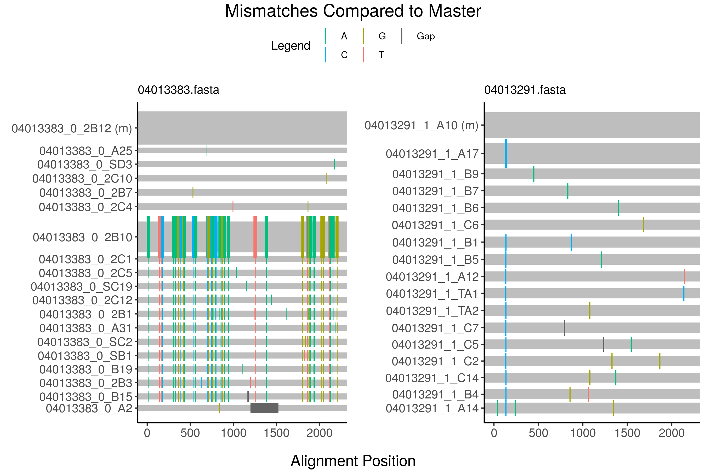

<!-- README.md is generated from README.Rmd. Please edit that file -->
highlineR: a tool for visualizing NGS datasets in R
===================================================

[Highlighter](https://www.hiv.lanl.gov/content/sequence/HIGHLIGHT/highlighter_top.html) is a web-based tool maintained by the Los Alamos National laboratory that makes it easy for investigators to quickly scan their NGS data for compositional differences. However, it is inconvenient for users to use Highlighter to process a large number of NGS files as the tool only accepts a single file as input and limits users to 500 sequences per file. Furthermore, the tool does not visualize the frequencies of different sequence variants in a dataset.

The 'highlineR' package provides users with easy-to-use functions for batch-processing of NGS data and generating plots similar to Highlighter that “stretch” lines to indicate variant frequencies in the data.

Installation
------------

You can install the development version from [GitHub](https://github.com/) with:

``` r
# install.packages("devtools")
devtools::install_github("PoonLab/highlineR")
```

Usage
-----

``` r
require(highlineR)
#> Loading required package: highlineR
files <- Sys.glob('~/git/highlineR/inst/extdata/*.fasta')
highline(files[1:2])  # render the first two alignments
```



Note that for the above example, the files were loaded from a developer directory. To load these same files from your installed package as a user, you'd have to replace the following line:

``` r
# files <- Sys.glob('~/git/highlineR/inst/extdata/*.fasta')
files <- Sys.glob(paste0(system.file(package='highlineR'), '/extdata/*.fasta'))
```
